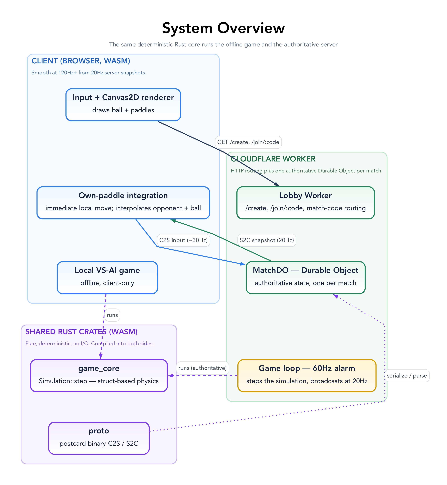
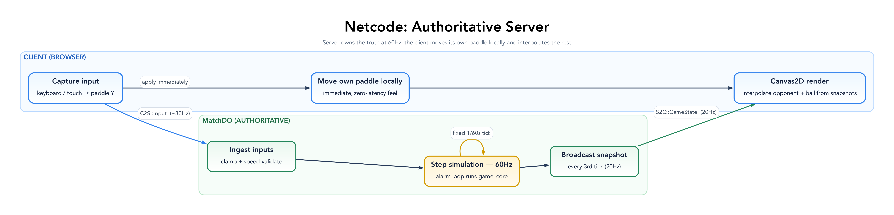

# Architecture Guide

This document explains the high-level design of Pongo, how the pieces fit together, and provides links to the code for deep dives.

## System Overview

Pongo is a real-time multiplayer game built on a shared-code architecture: the game logic is written in Rust and compiled to WebAssembly, and the _same_ code runs on the authoritative server (a Cloudflare Durable Object) and in the browser's offline VS-AI game. The server steps the simulation at 60Hz and broadcasts a state snapshot every third tick (20Hz); the client renders at display rate, interpolating between snapshots.

### High-Level Diagram

_Source: [`docs/diagrams/system-overview.dot`](docs/diagrams/system-overview.dot). All diagrams (and how they render) are in [docs/diagrams/](docs/diagrams/README.md)._

> [!NOTE]
> Durable Objects run "at the edge", but each match runs in a **single** location — wherever Cloudflare first instantiates the DO, typically near whoever created the match. Players far from that location still see light-speed latency; region-aware placement is a possible future improvement (see [docs/BACKLOG.md](docs/BACKLOG.md)).

## Core Patterns

Pongo is small, but it leans on a consistent set of patterns. Knowing these explains most of the code, and new code should fit one of them rather than inventing a parallel mechanism.

### Simulation (`game_core`)

- **One deterministic core, two hosts.** All gameplay lives in [`Simulation::step`](game_core/src/simulation.rs) — a pure, deterministic function (seeded RNG, fixed timestep, no I/O). It is run by the authoritative server ([`GameState::step`](server_do/src/game_state.rs)) and the offline VS-AI game ([`LocalGame::step`](client_wasm/src/simulation.rs)). The multiplayer client does **not** run it — it moves its own paddle locally and interpolates the opponent + ball from server snapshots. **Never fork gameplay into a host; add it to `game_core` so both stay identical.**
- **Plain structs, not an ECS.** The entity set is tiny and fixed (one `Ball`, up to two `Paddle`s — [`components.rs`](game_core/src/components.rs)), so `Simulation` holds them as plain fields. Behaviour lives in ordered systems ([`systems/`](game_core/src/systems)); the pipeline order (ingest inputs → move ball → move paddles → collisions → scoring) is defined once, in `step`.
- **The `Simulation` aggregate (parameter object).** The entities (`ball`, `paddles`) plus the resources (`Score, Events, NetQueue, GameRng, RespawnState`) are bundled into one [`Simulation`](game_core/src/simulation.rs) with `new(seed)` and `step(&mut self)`. Each host embeds one `Simulation` rather than threading the pieces individually.
- **Fixed timestep, host-owned accumulator.** `Simulation::step` advances exactly one `Params::FIXED_DT` tick — the single source for the timestep. Hosts feed real elapsed time into their own accumulator and call `step` the right number of times (the server alarm; the client's offline-game loop), so physics is frame-rate independent and reproducible.
- **Command queue for input.** Every input source — keyboard, touch, the AI, the network — funnels through `NetQueue::push_input(player_id, y)` as an absolute target Y, and `ingest_inputs` drains it onto the matching paddle's `target_y`. The simulation never knows where input came from.
- **Strongly-typed ids.** `PlayerId(u8)` ([`components.rs`](game_core/src/components.rs)) names a side (`PlayerId::LEFT` / `RIGHT`) so it can't be confused with a score or tick. The domain (game_core and the server's match logic) uses `PlayerId`; the wire protocol stays `u8`, converting at the boundary.
- **Config over a constants layer.** `Params` holds the `const` tuning values; `Config` ([`config.rs`](game_core/src/config.rs)) is the cloneable runtime struct seeded from them and threaded through systems. Tune gameplay in one place.

### Networking & client

- **Authoritative server, local own-paddle + interpolation.** The server owns the truth. The client applies its _own_ paddle input locally for a zero-latency feel and interpolates the opponent + ball from 20Hz snapshots ([`state.rs`](client_wasm/src/state.rs)). There's no prediction/reconciliation layer — the client isn't authoritative over anything that affects the other player.
- **One snapshot DTO.** [`GameStateSnapshot`](proto/src/lib.rs) is the single shape used both on the wire and for rendering; the client interpolates and exponentially smooths remote entities from it ([`state.rs`](client_wasm/src/state.rs)).
- **Tagged-enum binary protocol, append-only.** [`proto::{C2S, S2C}`](proto/src/lib.rs) are `postcard`-serialised enums with `to_bytes`/`from_bytes` helpers. Postcard encodes the variant index positionally, so **add new variants at the end** to stay compatible with clients connected across a deploy.
- **FSM: logic in Rust, effects in JS.** Valid states and transitions live in [`fsm.rs`](client_wasm/src/fsm.rs); side effects (DOM, sockets, timers) live in the JS wrapper. Full detail in [docs/STATE_MACHINE.md](docs/STATE_MACHINE.md).
- **wasm-bindgen facade.** `WasmClient` ([`lib.rs`](client_wasm/src/lib.rs)) is the thin, JS-callable surface over the internal `Client`; JS holds no game state of its own.

### Server (Durable Object)

- **Ports & adapters for testability.** The DO logic depends on two traits — `GameClient` (a sendable socket) and `Environment` (time + logging) — not on concrete Workers types, so [`game_state.rs`](server_do/src/game_state.rs) is unit-tested natively with `MockGameClient`/`MockEnv` ([`tests.rs`](server_do/src/tests.rs)). Keep new server logic in `GameState` (testable), not in the thin `#[durable_object]` shell.
- **Interior mutability, borrow dropped before await.** The DO holds `RefCell<GameState>`; handlers must `drop` the borrow before any `.await` (see the alarm loop in [`lib.rs`](server_do/src/lib.rs)).
- **Identify sockets by attachment.** Each socket is tagged with its player id via `serialize_attachment`; the close/ping handlers recover it with `deserialize_attachment`. Never guess the player from map order.
- **Fire-and-forget broadcast.** Sends to clients ignore per-socket errors (`let _ = …send`); a dead socket is reaped by the close handler, not by send failures.

## Codebase Map

The project is structured as a Cargo workspace with shared crates.

| Crate            | Path                             | Description                                                                                                             | Key Files                                                                                                                 |
| ---------------- | -------------------------------- | ----------------------------------------------------------------------------------------------------------------------- | ------------------------------------------------------------------------------------------------------------------------- |
| **game_core**    | [`game_core/`](game_core/)       | **The Heart.** Shared struct-based simulation, physics, and config.                                                     | [`simulation.rs`](game_core/src/simulation.rs) (`Simulation::step`) [`config.rs`](game_core/src/config.rs) (constants) |
| **client_wasm**  | [`client_wasm/`](client_wasm/)   | **The Frontend.** Interpolation and Canvas2D rendering.                                                                 | [`lib.rs`](client_wasm/src/lib.rs) (entry) [`canvas2d.rs`](client_wasm/src/canvas2d.rs) (renderer)                     |
| **server_do**    | [`server_do/`](server_do/)       | **The Backend.** Durable Object implementation.                                                                         | [`game_state.rs`](server_do/src/game_state.rs) (server logic)                                                             |
| **proto**        | [`proto/`](proto/)               | **The Glue.** Network messages and serialization.                                                                       | [`lib.rs`](proto/src/lib.rs) (structs)                                                                                    |
| **lobby_worker** | [`lobby_worker/`](lobby_worker/) | **The Lobby.** HTTP routing, match-code generation, and the static front-end (the JS FSM driver). Re-exports `MatchDO`. | [`src/lib.rs`](lobby_worker/src/lib.rs) (router) [`script.js`](lobby_worker/script.js) (FSM driver)                    |

The `worker/` directory holds the wasm-pack build output (`pkg/`, gitignored) plus [`index.js`](worker/index.js), the Worker entry shim that initialises the WASM and wires the Durable Object lifecycle.

---

## Key Data Flows

_Source: [`docs/diagrams/netcode-loop.dot`](docs/diagrams/netcode-loop.dot)._

### Input Handling

1. Browser captures key press in [`on_key_down`](client_wasm/src/lib.rs).
2. Client updates local paddle immediately.
3. Client sends `C2S::Input` to server.
4. Server validates input (enforcing speed limits) and updates the paddle's target.
5. Server includes new paddle position in next broadcast.

### Rendering Frame

1. `requestAnimationFrame` calls [`render`](client_wasm/src/lib.rs).
2. In a local game, the simulation steps; in a match, remote entities are interpolated toward the latest snapshot.
3. [`Renderer::draw`](client_wasm/src/canvas2d.rs) paints the arena, paddles, and ball onto the canvas.

---

## Technical Reference

### Game Constants

| Constant         | Value     | Unit      |
| ---------------- | --------- | --------- |
| Arena            | 32 × 24   | units     |
| Paddle           | 0.8 × 4.0 | units     |
| Paddle speed     | 18        | units/sec |
| Ball radius      | 0.5       | units     |
| Ball speed       | 12 → 24   | units/sec |
| Speed multiplier | 1.05×     | per hit   |
| Win score        | 5         | points    |

_Constants defined in [`game_core/src/config.rs`](game_core/src/config.rs)_

### Network Protocol

The authoritative definitions live in [`proto/src/lib.rs`](proto/src/lib.rs); variants are appended, never reordered (postcard encodes the variant index positionally).

**Client → Server (`C2S`):** `Join { code }` · `Input { player_id, y, seq }` · `Ping { t_ms }` · `Restart`

**Server → Client (`S2C`):** `Welcome { player_id }` · `MatchFound` · `Countdown { seconds }` · `GameStart` · `GameState(GameStateSnapshot)` · `GameOver { winner }` · `OpponentDisconnected` · `Pong { t_ms }` · `OpponentReconnecting` · `OpponentReconnected`

### Entities & Systems

**Entities:** `Paddle { player_id, y, target_y, velocity_y }` · `Ball { pos, vel }`

**Resources:** `Score` · `Events` · `NetQueue` · `GameRng` · `RespawnState`

**Systems:** IngestInputs → MoveBall → MovePaddles → CheckCollisions → CheckScoring

### Physics

- **Walls:** Reflect Y velocity
- **Paddles:** Reflect X velocity + spin from both hit position and the paddle's vertical motion
- **Speed:** +5% per hit, max 24 u/s
