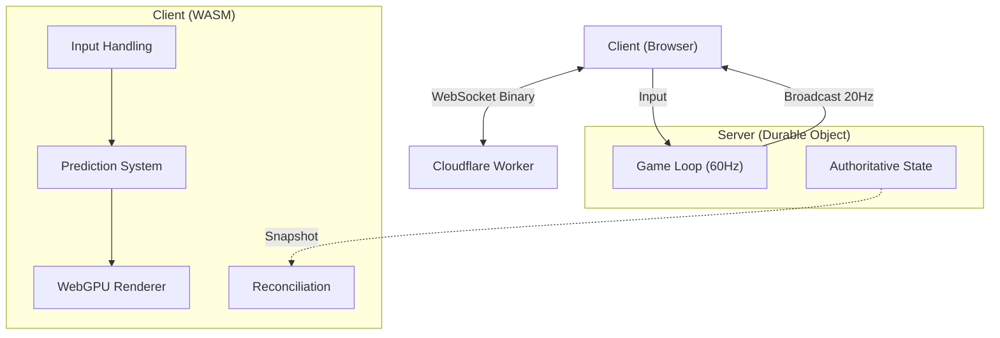

# Architecture Guide

This document explains the high-level design of Pongo, how the pieces fit together, and provides links to the code for deep dives.

## System Overview

Pongo is a real-time multiplayer game built on a shared-code architecture. The core game logic is written in Rust and compiled to WebAssembly (WASM) for both the client (browser) and server (Cloudflare Durable Objects).

### High-Level Diagram

## Core Patterns

Pongo is small, but it leans on a consistent set of patterns. Knowing these explains most of the code, and new code should fit one of them rather than inventing a parallel mechanism.

### Simulation (`game_core`)

- **One deterministic core, three hosts.** All gameplay lives in [`game_core::step`](game_core/src/lib.rs) — a pure, deterministic function (seeded RNG, fixed timestep, no I/O). It is run by everything that advances the game: the authoritative server ([`GameState::step`](server_do/src/game_state.rs)), the offline VS-AI game ([`LocalGame::step`](client_wasm/src/simulation.rs)), and the client-side predictor ([`ClientPredictor`](client_wasm/src/prediction.rs)). Determinism is the enabling property — it is what lets the client predict and reconcile against the server. **Never fork gameplay into a host; add it to `game_core` so all three stay identical.**
- **ECS (hecs).** Entities hold components — `Paddle`, `Ball`, `PaddleIntent` ([`components.rs`](game_core/src/components.rs)); behaviour lives in ordered systems ([`systems/`](game_core/src/systems)). The pipeline order (ingest inputs → move ball → move paddles → collisions → scoring) is defined once, in `step`. Add behaviour as a system; add entity state as a component.
- **Resources alongside the World.** State that is not per-entity — `Time, Score, Events, NetQueue, GameRng, RespawnState` ([`resources.rs`](game_core/src/resources.rs)) — is the ECS "resource" concept, passed explicitly to systems. (These nine values travel together everywhere — see [Patterns to adopt](#patterns-to-adopt).)
- **Fixed timestep + accumulator.** `step` integrates in fixed `Params::FIXED_DT` micro-steps regardless of frame time, so physics is frame-rate independent and reproducible. Hosts feed real elapsed time into an accumulator (the server alarm; the client `step_simulation`).
- **Command queue for input.** Every input source — keyboard, touch, the AI, the network — funnels through `NetQueue::push_input(player_id, y)` as an absolute target Y, and `ingest_inputs` drains it into `PaddleIntent`. The simulation never knows where input came from.
- **Config over a constants layer.** `Params` holds the `const` tuning values; `Config` ([`config.rs`](game_core/src/config.rs)) is the cloneable runtime struct seeded from them and threaded through systems. Tune gameplay in one place.

### Networking & client

- **Authoritative server, client prediction + reconciliation.** The server owns the truth; the client applies local input immediately (prediction) and snaps to server snapshots when they disagree (reconciliation). See [`prediction.rs`](client_wasm/src/prediction.rs).
- **One snapshot DTO.** [`GameStateSnapshot`](proto/src/lib.rs) is the single shape used both on the wire and for rendering; the client interpolates and exponentially smooths remote entities from it ([`state.rs`](client_wasm/src/state.rs)).
- **Tagged-enum binary protocol, append-only.** [`proto::{C2S, S2C}`](proto/src/lib.rs) are `postcard`-serialised enums with `to_bytes`/`from_bytes` helpers. Postcard encodes the variant index positionally, so **add new variants at the end** to stay compatible with clients connected across a deploy.
- **FSM: logic in Rust, effects in JS.** Valid states and transitions live in [`fsm.rs`](client_wasm/src/fsm.rs); side effects (DOM, sockets, timers) live in the JS wrapper. Full detail in [docs/STATE_MACHINE.md](docs/STATE_MACHINE.md).
- **wasm-bindgen facade.** `WasmClient` ([`lib.rs`](client_wasm/src/lib.rs)) is the thin, JS-callable surface over the internal `Client`; JS holds no game state of its own.

### Server (Durable Object)

- **Ports & adapters for testability.** The DO logic depends on two traits — `GameClient` (a sendable socket) and `Environment` (time + logging) — not on concrete Workers types, so [`game_state.rs`](server_do/src/game_state.rs) is unit-tested natively with `MockGameClient`/`MockEnv` ([`tests.rs`](server_do/src/tests.rs)). Keep new server logic in `GameState` (testable), not in the thin `#[durable_object]` shell.
- **Interior mutability, borrow dropped before await.** The DO holds `RefCell<GameState>`; handlers must `drop` the borrow before any `.await` (see the alarm loop in [`lib.rs`](server_do/src/lib.rs)).
- **Identify sockets by attachment.** Each socket is tagged with its player id via `serialize_attachment`; the close/ping handlers recover it with `deserialize_attachment`. Never guess the player from map order.
- **Fire-and-forget broadcast.** Sends to clients ignore per-socket errors (`let _ = …send`); a dead socket is reaped by the close handler, not by send failures.

## Patterns to adopt

Patterns the code already implies but does not yet use. Tracked in [docs/BACKLOG.md](docs/BACKLOG.md).

- **A `Simulation` aggregate (parameter object).** `game_core::step` takes nine arguments (hence its `#[allow(clippy::too_many_arguments)]`), and the _same_ nine fields — `world, time, map, config, score, events, net_queue, rng, respawn_state` — are re-declared by `GameState`, `LocalGame`, and `ClientPredictor`. Bundle them into one `Simulation` in `game_core` with `Simulation::new(seed)` and `step(&mut self)`; the three hosts then embed one `Simulation` instead of nine fields. Removes the duplication, deletes the nine-arg signature, and gives the simulation a single named type.
- **Make illegal states unrepresentable.** `ClientPredictor` carries the bundle as nine separate `Option<T>` fields that are always all-`Some` or all-`None`. With the aggregate above it collapses to one `Option<Simulation>` — a single source of truth for "is the predictor running".
- **Single source for the timestep.** The fixed step is spelled three slightly different ways (`Params::FIXED_DT` = 0.0166, `Time::default` `dt` = 0.016, `1.0 / 60.0` in the hosts). Route them all through `Params::FIXED_DT`. (There are also two paddle-Y clamp helpers, `GameMap::clamp_y` and `Config::clamp_paddle_y`, worth consolidating.)
- **Newtype `PlayerId`.** `player_id: u8` is threaded widely; a `PlayerId(u8)` newtype would stop it being mixed up with scores or ticks. Low priority.

## Codebase Map

The project is structured as a Cargo workspace with shared crates.

| Crate            | Path                             | Description                                                                                                             | Key Files                                                                                              |
| ---------------- | -------------------------------- | ----------------------------------------------------------------------------------------------------------------------- | ------------------------------------------------------------------------------------------------------ |
| **game_core**    | [`game_core/`](game_core/)       | **The Heart.** Shared ECS logic, physics, and config.                                                                   | [`lib.rs`](game_core/src/lib.rs) (step function) [`config.rs`](game_core/src/config.rs) (constants) |
| **client_wasm**  | [`client_wasm/`](client_wasm/)   | **The Frontend.** Prediction, interpolation, and rendering.                                                             | [`lib.rs`](client_wasm/src/lib.rs) (entry) [`renderer/`](client_wasm/src/renderer) (WebGPU)         |
| **server_do**    | [`server_do/`](server_do/)       | **The Backend.** Durable Object implementation.                                                                         | [`game_state.rs`](server_do/src/game_state.rs) (server logic)                                          |
| **proto**        | [`proto/`](proto/)               | **The Glue.** Network messages and serialization.                                                                       | [`lib.rs`](proto/src/lib.rs) (structs)                                                                 |
| **lobby_worker** | [`lobby_worker/`](lobby_worker/) | **The Lobby.** HTTP routing, match-code generation, and the static front-end (the JS FSM driver). Re-exports `MatchDO`. | [`src/lib.rs`](lobby_worker/src/lib.rs) (router) [`script.js`](lobby_worker/script.js) (FSM driver) |

---

## How It Works

### 1. The Game Loop (`game_core`)

The simulation is deterministic and frame-independent. It uses a fixed timestep (60Hz) with an accumulator to ensure physics consistency across different frame rates.

- **Entry Point:** [`step`](game_core/src/lib.rs#L19)
- **Physics:** [`systems/movement.rs`](game_core/src/systems/movement.rs) handles movement, [`systems/collision.rs`](game_core/src/systems/collision.rs) handles bounces.
- **ECS:** We use [hecs](https://docs.rs/hecs) for entity management.

### 2. The Server (`server_do`)

Each game match runs in a Cloudflare **Durable Object** (DO). The DO maintains the authoritative state and runs the `step` function 60 times a second.

- **Tick Loop:** The server calls `GameState::step` which delegates to `game_core::step`.
- **Broadcasting:** Every 3rd tick (20Hz), it sends a snapshot to all clients via `broadcast_state`.

> [!NOTE]
> **Edge Latency Nuance:** While Durable Objects run "at the edge," each specific match runs in a **single location**. Frame updates still suffer light-speed latency for players far from that specific data center. Global latency is mitigated by region-aware matchmaking, ensuring players match in a DO close to both of them.

### 3. The Client (`client_wasm`)

The client needs to be smooth (120Hz+) even though headers only arrive at 20Hz.

- **Prediction:** The [`ClientPredictor`](client_wasm/src/prediction.rs) applies local inputs immediately so the player feels zero latency.
- **Reconciliation:** When a server snapshot arrives, if it disagrees with the local prediction significantly, the client resets to the authoritative server state.
- **Rendering:** [`Renderer`](client_wasm/src/renderer/mod.rs) uses WebGPU to draw the state. It interpolates remote entities (opponent paddle, ball) for smoothness.

### 4. Networking (`proto`)

We use [postcard](https://github.com/jamesmunns/postcard) for efficient binary serialization over WebSockets.

- **C2S (Client to Server):** Input, Join, Ping.
- **S2C (Server to Client):** GameState, Welcome, GameOver.
- **Definitions:** See [`proto/src/lib.rs`](proto/src/lib.rs).

### 5. Game States (Client FSM)

The client flow — menus → matchmaking → gameplay, plus local pause and multiplayer reconnect — is a finite state machine: valid transitions live in Rust ([`fsm.rs`](client_wasm/src/fsm.rs)), side effects in the JS wrapper. See **[docs/STATE_MACHINE.md](docs/STATE_MACHINE.md)** for the states, the transition lock, the pause/reconnect behaviour, and the full diagram (kept there as the single source so the two don't drift).

---

## Key Data Flows

### Input Handling

1. Browser captures key press in [`on_key_down`](client_wasm/src/lib.rs).
2. Client updates local paddle immediately.
3. Client sends `C2S::Input` to server.
4. Server validates input (enforcing speed limits) and updates entity intent.
5. Server includes new paddle position in next broadcast.

### Rendering Frame

1. `requestAnimationFrame` calls [`render`](client_wasm/src/lib.rs).
2. Prediction system updates local game state.
3. [`Renderer::draw`](client_wasm/src/renderer/mod.rs) submits draw commands to GPU.

---

## Technical Reference

### Game Constants

| Constant         | Value     | Unit      |
| ---------------- | --------- | --------- |
| Arena            | 32 × 24   | units     |
| Paddle           | 0.8 × 4.0 | units     |
| Paddle speed     | 18        | units/sec |
| Ball radius      | 0.5       | units     |
| Ball speed       | 12 → 24   | units/sec |
| Speed multiplier | 1.05×     | per hit   |
| Win score        | 5         | points    |

_Constants defined in [`game_core/src/config.rs`](game_core/src/config.rs)_

### Network Protocol

The authoritative definitions live in [`proto/src/lib.rs`](proto/src/lib.rs); variants are appended, never reordered (postcard encodes the variant index positionally).

**Client → Server (`C2S`):** `Join { code }` · `Input { player_id, y, seq }` · `Ping { t_ms }` · `Restart`

**Server → Client (`S2C`):** `Welcome { player_id }` · `MatchFound` · `Countdown { seconds }` · `GameStart` · `GameState(GameStateSnapshot)` · `GameOver { winner }` · `OpponentDisconnected` · `Pong { t_ms }` · `OpponentReconnecting` · `OpponentReconnected`

### ECS Components & Systems

**Components:** `Paddle { player_id, y }` · `Ball { pos, vel }` · `PaddleIntent { target_y, velocity_y }`

**Resources:** `Time` · `Score` · `Events` · `NetQueue` · `GameRng` · `RespawnState`

**Systems:** IngestInputs → MoveBall → MovePaddles → CheckCollisions → CheckScoring

### Physics

- **Walls:** Reflect Y velocity
- **Paddles:** Reflect X velocity + spin from both hit position and the paddle's vertical motion
- **Speed:** +5% per hit, max 24 u/s
