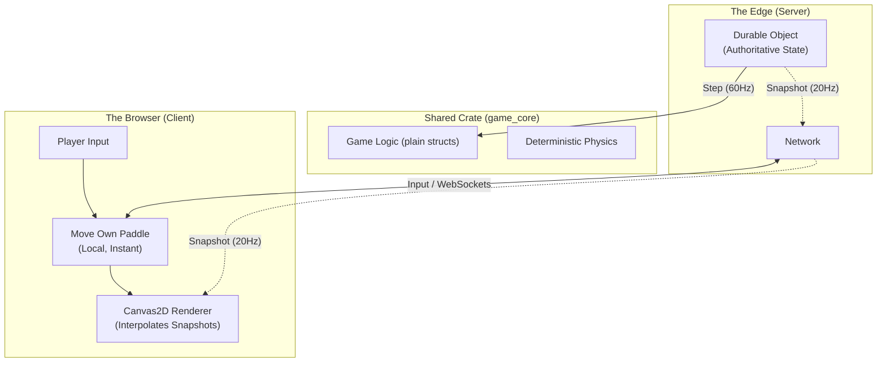
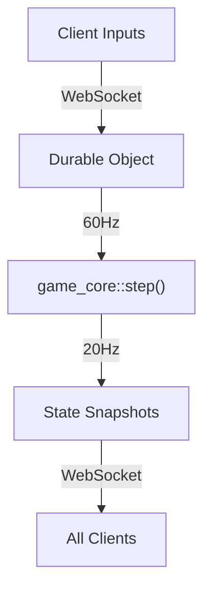
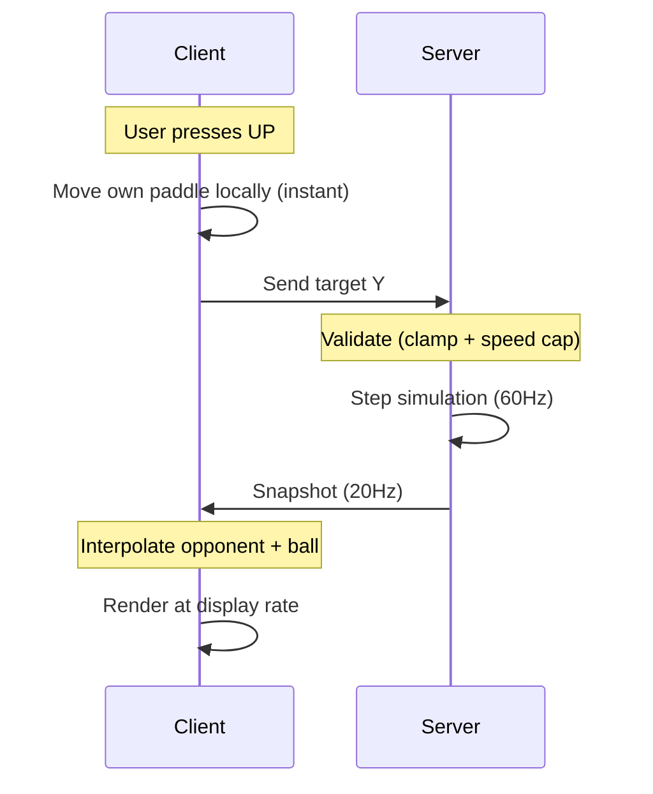

# How I Built a Real-Time Multiplayer Game on the Edge with Rust and WebAssembly

> _Real-time multiplayer games are mostly about trade-offs: latency vs authority, simplicity vs correctness, and cost vs control. This article walks through an approach that worked well for me — using Rust compiled to WebAssembly to share deterministic game logic between the browser and Cloudflare’s edge._

**[Play the live demo →](https://pongo.tre.systems/)** | **[View source on GitHub →](https://github.com/tre-systems/pongo)**

---

## Why Pong?

In 1972, Atari released _Pong_, effectively kicking off the video game industry. More than fifty years later, it turns out to be a great test case for multiplayer networking.

In many modern games, latency can be masked with animation, camera tricks, or generous hitboxes. Pong gives you none of that. The physics are simple, the ball is fast, and if your paddle isn’t exactly where you expect it to be, you feel it immediately.

It demands:

1. **Precise movement** — high-frequency input sampling.
2. **Instant feedback** — minimal perceived latency.
3. **State validation** — preventing the client and server from drifting apart.

If I can make this work for a browser-based Pong running entirely on serverless infrastructure, the same patterns apply to much more complex games.

---

## The Architecture: One Codebase, Two Worlds

When building **Pongo**, my goal wasn’t just to recreate a classic — it was to explore a very specific question:

**How do you deliver a smooth 60FPS experience while still keeping a secure, authoritative server?**

The solution I landed on was a kind of “universal app” architecture, built with **Rust**, **WebAssembly (WASM)**, and **Cloudflare Durable Objects**.

Most multiplayer games try to share logic between client and server, but language boundaries usually get in the way. By writing the core game logic in Rust, I can compile it to WebAssembly and run the _same code_ in two very different environments:

1. **The Browser** — rendering at 120Hz+ with Canvas2D.
2. **The Edge** — running inside a Cloudflare Durable Object at a fixed 60Hz.



---

## 1. The Shared Core (`game_core`)

At the heart of the project is the `game_core` crate. The entity set is tiny and fixed — one ball and up to two paddles — so it models them as plain Rust structs rather than reaching for an ECS.

The physics simulation lives in a deterministic `step` function. It uses fixed timesteps and predictable math (via [`glam`](https://docs.rs/glam)) so that, given the same inputs, it produces the same results on both the client (WASM) and the server.

Here’s the actual `step` function that runs in both environments:

```rust
// game_core/src/simulation.rs

impl Simulation {
    // Advances exactly ONE fixed 1/60s tick. The host — the server's 60Hz
    // alarm, or the browser's offline-game loop — owns the accumulator and
    // calls this the right number of times, so physics stays frame-rate
    // independent and reproducible.
    pub fn step(&mut self) {
        ingest_inputs(&mut self.paddles, &mut self.net_queue);
        move_ball(&mut self.ball, Params::FIXED_DT);
        move_paddles(&mut self.paddles, &self.config, Params::FIXED_DT);
        check_collisions(&mut self.ball, &self.paddles, &self.map, &self.config, &mut self.events);
        check_scoring(&mut self.ball, &self.map, &mut self.score, &mut self.events, &mut self.respawn_state);
    }
}
```

This is deliberately boring code.  
Simulation state goes in, the next tick's state comes out.

---

## 2. Server: Authority at the Edge

Each match runs inside a **Cloudflare Durable Object**. A Durable Object is a single-threaded instance that can hold in-memory state and, crucially, run a continuous loop.

This is the key difference from typical stateless serverless functions: a Durable Object can host a proper **game loop**.



The server advances the simulation at ~60Hz but only broadcasts authoritative snapshots every third tick (~20Hz) to keep bandwidth and costs under control.

The server is the authority.  
If the client thinks the ball is at `x = 100` but the server says `x = 102`, the server wins. Always.

For paddles, the server uses **Target-Based Validation**. It accepts the client's desired position but moves the authoritative paddle towards that target at the maximum allowed speed. This prevents teleportation cheats while maintaining responsiveness.

---

## 3. Client: Instant Local Feedback

Pong is unforgiving about input latency, so the client moves _its own_ paddle locally the instant you press a key — it never waits for the server to confirm. Everything else (the opponent's paddle and the ball) is interpolated and smoothed from the authoritative snapshots as they arrive.

The trick is what the client is allowed to be authoritative over: **nothing** that affects the other player. Its paddle target is still sent to the server, validated, and echoed back in the next snapshot. Because the client never simulates the opponent or the ball, there is no divergence to detect — so Pongo needs no client-side prediction or reconciliation layer at all. The local paddle move is just instant feedback; the server's snapshot is always the truth.



---

## 4. Rendering with Canvas2D

Rendering is deliberately simple: a small [Canvas2D](https://developer.mozilla.org/en-US/docs/Web/API/CanvasRenderingContext2D) renderer draws the arena, paddles, and ball. The simulation runs at 60Hz and the server only broadcasts snapshots at 20Hz, but displays often refresh at 120Hz or higher, so the client interpolates entity positions between snapshots to keep visuals smooth. There is no GPU pipeline to set up — it works everywhere a `<canvas>` does.

---

## 5. Efficient Serialization with `postcard`

All WebSocket messages are serialized using [`postcard`](https://docs.rs/postcard), a compact binary format that produces far smaller payloads than JSON. This reduces latency and keeps request counts (and costs) under control.

---

## Economics & Limitations: Is this actually free?

“Serverless” sounds cheap until you start sending messages 60 times a second.

Cloudflare bills Durable Objects based on **requests** and **execution time (GB-s)**.

- **Free tier**: ~30 minutes of total gameplay per day.
- **Paid plan ($5/month)**: ~50 hours of active gameplay per month before overages.

Durable Objects are also single-region, which means global latency must be handled explicitly with region-aware matchmaking.

---

## Conclusion

By leaning on Rust’s ability to target WebAssembly, Pongo ends up with a clean and pragmatic architecture:

1. **Low latency** through local own-paddle movement and snapshot interpolation.
2. **Strong authority** via deterministic server simulation.
3. **Low operational overhead** by running game loops at the edge.

You don’t need a traditional fleet of dedicated servers to build a responsive multiplayer game in 2024 — but you do need to be deliberate about determinism, networking, and cost.

---

## A Note on AI-Assisted Development

This project was built with heavy AI assistance — but not in a “one prompt and done” way.

I used Google Antigravity with multiple models, picking slower, reasoning-heavy models for hard problems and faster models for iteration, refactoring, and routine cleanup. That division of labour turned out to be a very effective workflow.
