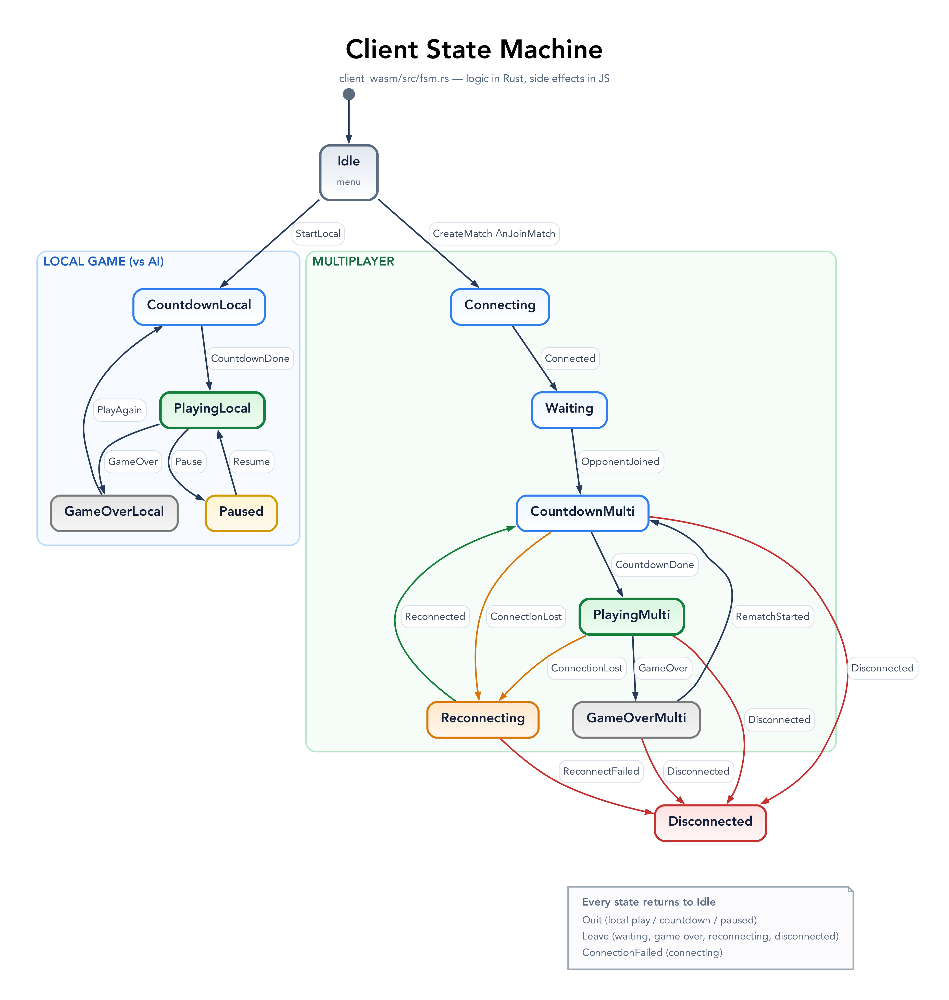

# State Machine

The client game flow is driven by a finite state machine with a deliberate split:

- **Logic** — the valid states and transitions — lives in Rust, compiled to WASM: `client_wasm/src/fsm.rs`.
- **Side effects** — DOM, UI, and WebSocket I/O — live in JavaScript: the `FSM` wrapper in `lobby_worker/script.js`.

Rust answers "is this transition allowed?"; JavaScript performs "what happens on enter/exit". The Rust FSM holds only the current `FsmState` — no game data (scores, positions) and no side effects.

## States and actions

`FsmState` (`client_wasm/src/fsm.rs`): `Idle`, `CountdownLocal`, `PlayingLocal`, `Paused`, `GameOverLocal`, `Connecting`, `Waiting`, `CountdownMulti`, `PlayingMulti`, `GameOverMulti`, `Disconnected`, `Reconnecting`.

`GameAction`: `StartLocal`, `CreateMatch`, `JoinMatch`, `CountdownDone`, `Quit`, `GameOver`, `Connected`, `ConnectionFailed`, `OpponentJoined`, `Disconnected`, `Leave`, `PlayAgain`, `RematchStarted`, `Pause`, `Resume`, `ConnectionLost`, `Reconnected`, `ReconnectFailed`.

`GameFsm::get_next_state` is the single transition table; invalid `state + action` pairs are rejected. The FSM is exposed to JS via `wasm_bindgen` (`transition_str`, `state`) and is fully unit-tested in `fsm.rs`.

## Flow

_Source: [`diagrams/client-fsm.dot`](diagrams/client-fsm.dot) — rendered via `npm run diagrams` (see [diagrams/](diagrams/README.md))._

## The JS wrapper and the transition lock

`lobby_worker/script.js` wraps the Rust FSM instance. Each `transition(action)`:

1. Rejects the action if a transition is already running (an `isTransitioning` guard).
2. Calls the Rust FSM to validate and advance the state (synchronous).
3. Runs the async `exitState(prev)` then `enterState(next)` side effects.
4. Releases the lock in a `finally` block.

The `isTransitioning` lock serialises transitions so that rapid events — for example a disconnect arriving mid-countdown — cannot interleave the enter/exit handlers and desync the UI.

**Deadlock note:** because an enter-handler runs while the lock is held, it must not synchronously drive another transition through the wrapper, or it will deadlock against its own lock. Where a state needs to advance immediately (e.g. `CountdownLocal` firing `CountdownDone` once the countdown animation finishes), the handler schedules that next transition without awaiting it, so the current transition completes and releases the lock first. See `enterCountdownLocal` in `script.js`.

## Design notes

- The FSM is exported from `client_wasm`, but the Rust `Client` simulation does not read it: the render/sim loop keys off a presence check (`local_game.is_some()` for offline vs. multiplayer) rather than the FSM state. The FSM governs UI and flow in JS, not the Rust simulation.
- A `GameState` object in `script.js` mirrors `FsmState` for DOM/CSS use.

## Pause (local games)

`PlayingLocal` can transition to `Paused` (via the pause button or the `Escape`/`P` keys) and back with `Resume`. Pausing stops the render loop, which freezes the local simulation; resuming calls `reset_sim_timing` so the first frame doesn't accumulate a large `dt` and fast-forward the ball. Pause is local-only — multiplayer can't pause a live opponent — so the action is not valid from `PlayingMulti`.

## Reconnect (multiplayer)

When a multiplayer socket drops mid-match, the client goes to `Reconnecting` (via `ConnectionLost`) rather than straight to `Disconnected`. It shows a "reconnecting" overlay and retries the WebSocket within the server's grace window; the server (`server_do`) holds the dropped player's slot and freezes the sim (`MatchState::Paused`) until they return or the grace period (`RECONNECT_GRACE_MS`) expires. A successful rejoin resumes via a fresh ready-countdown (`Reconnected` → `CountdownMulti`); exhausting the retries ends the match (`ReconnectFailed` → `Disconnected`). The still-connected player sees an "opponent reconnecting" overlay driven by the `OpponentReconnecting` / `OpponentReconnected` messages.
